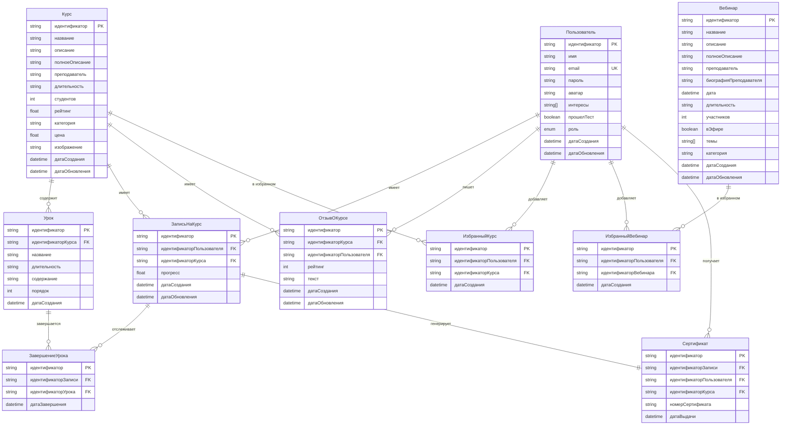
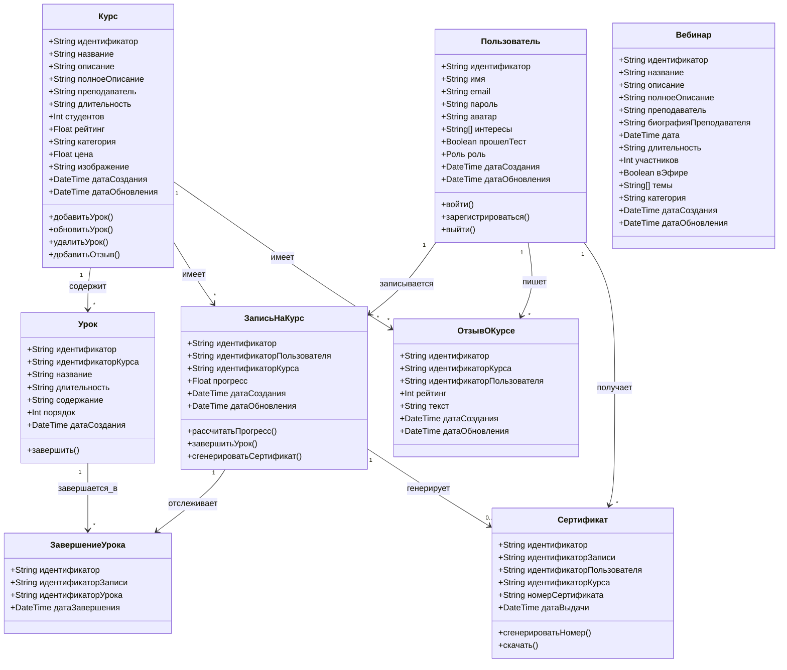
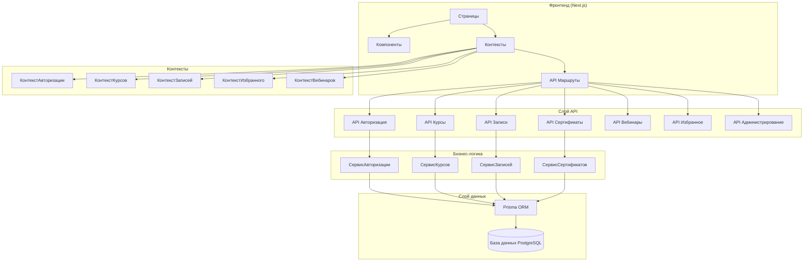
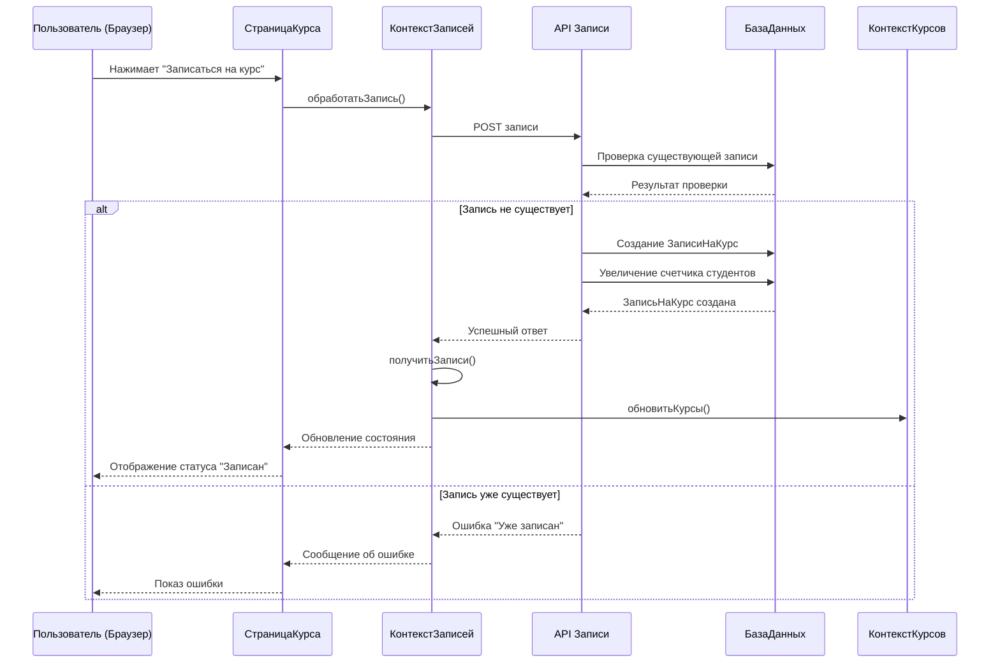
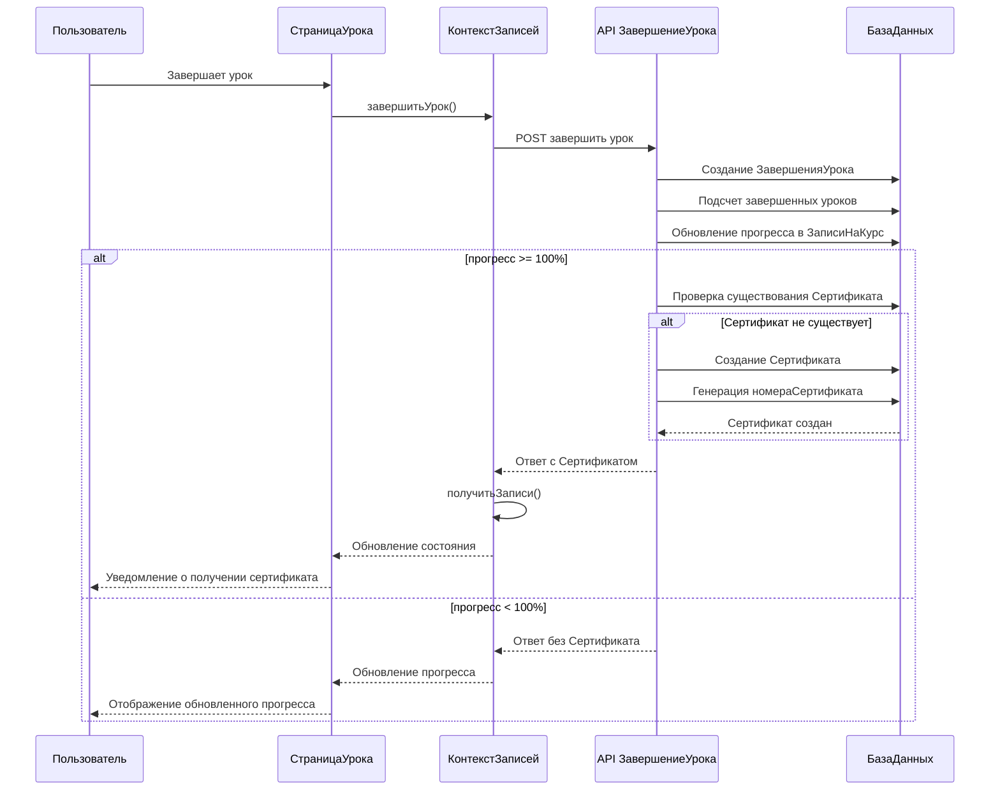
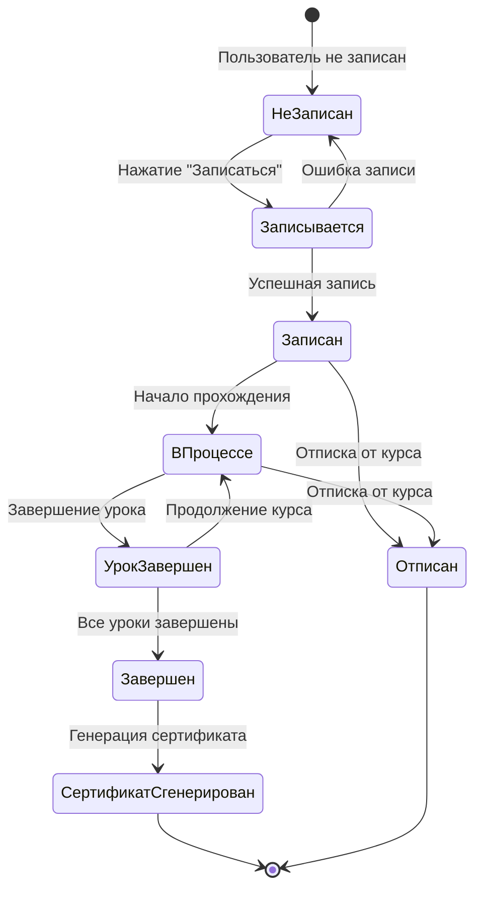
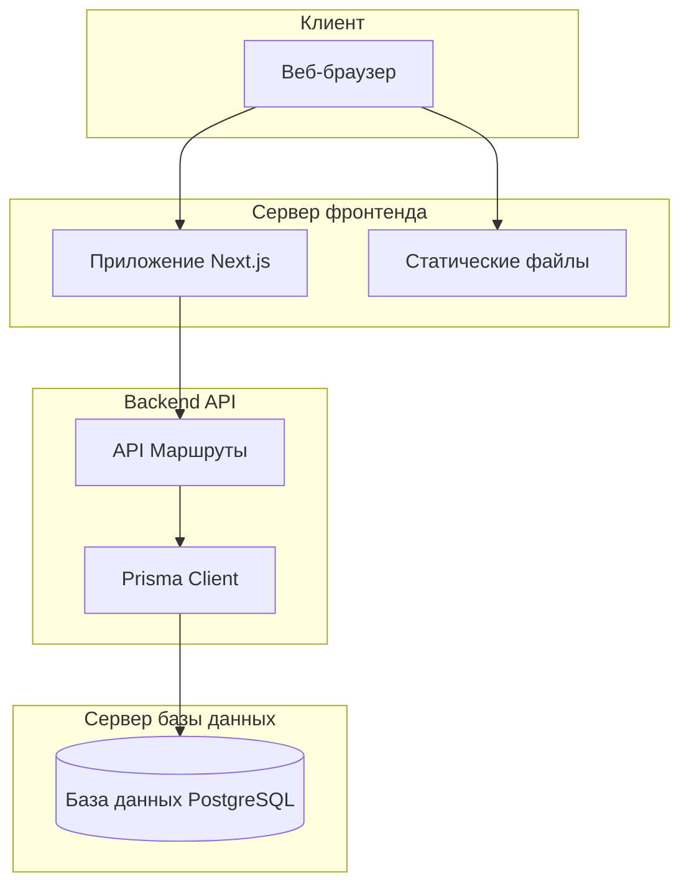

# UML Диаграммы для EduPlatform

## 1. ER-диаграмма (Entity-Relationship Diagram)

## 2. Диаграмма классов (Class Diagram)

## 3. Диаграмма компонентов (Component Diagram)

## 4. Диаграмма последовательности - Запись на курс

## 5. Диаграмма последовательности - Завершение урока и получение сертификата

## 6. Диаграмма состояний - Запись на курс

## 7. Диаграмма вариантов использования (Use Case Diagram)

```mermaid
graph TB
    subgraph "Актеры"
        Student[Студент]
        Teacher[Преподаватель]
        Admin[Администратор]
    end
    
    subgraph "Основные функции"
        UC1[Регистрация/Вход]
        UC2[Просмотр курсов]
        UC3[Запись на курс]
        UC4[Прохождение уроков]
        UC5[Получение сертификата]
        UC6[Просмотр вебинаров]
        UC7[Добавление в избранное]
        UC8[Оставление отзывов]
        UC9[Создание курса]
        UC10[Управление уроками]
        UC11[Управление пользователями]
        UC12[Просмотр статистики]
    end
    
    Student --> UC1
    Student --> UC2
    Student --> UC3
    Student --> UC4
    Student --> UC5
    Student --> UC6
    Student --> UC7
    Student --> UC8
    
    Teacher --> UC1
    Teacher --> UC2
    Teacher --> UC9
    Teacher --> UC10
    Teacher --> UC8
    
    Admin --> UC1
    Admin --> UC2
    Admin --> UC9
    Admin --> UC10
    Admin --> UC11
    Admin --> UC12
```

## 8. Диаграмма развертывания (Deployment Diagram)

## Описание диаграмм

### 1. ER-диаграмма
Показывает структуру базы данных, связи между таблицами и основные атрибуты каждой сущности.

### 2. Диаграмма классов
Отображает основные классы системы, их атрибуты и методы, а также отношения между классами.

### 3. Диаграмма компонентов
Демонстрирует архитектуру приложения, разделение на слои (Фронтенд, API, Бизнес-логика, Слой данных).

### 4. Диаграмма последовательности - Запись на курс
Показывает пошаговый процесс записи пользователя на курс с взаимодействием между компонентами.

### 5. Диаграмма последовательности - Завершение урока
Иллюстрирует процесс завершения урока, обновления прогресса и автоматической генерации сертификата при достижении 100%.

### 6. Диаграмма состояний
Отображает жизненный цикл записи на курс от момента записи до получения сертификата.

### 7. Диаграмма вариантов использования
Показывает основные функции системы и роли пользователей, которые могут их выполнять.

### 8. Диаграмма развертывания
Демонстрирует физическую архитектуру системы и взаимодействие между компонентами на уровне инфраструктуры.
