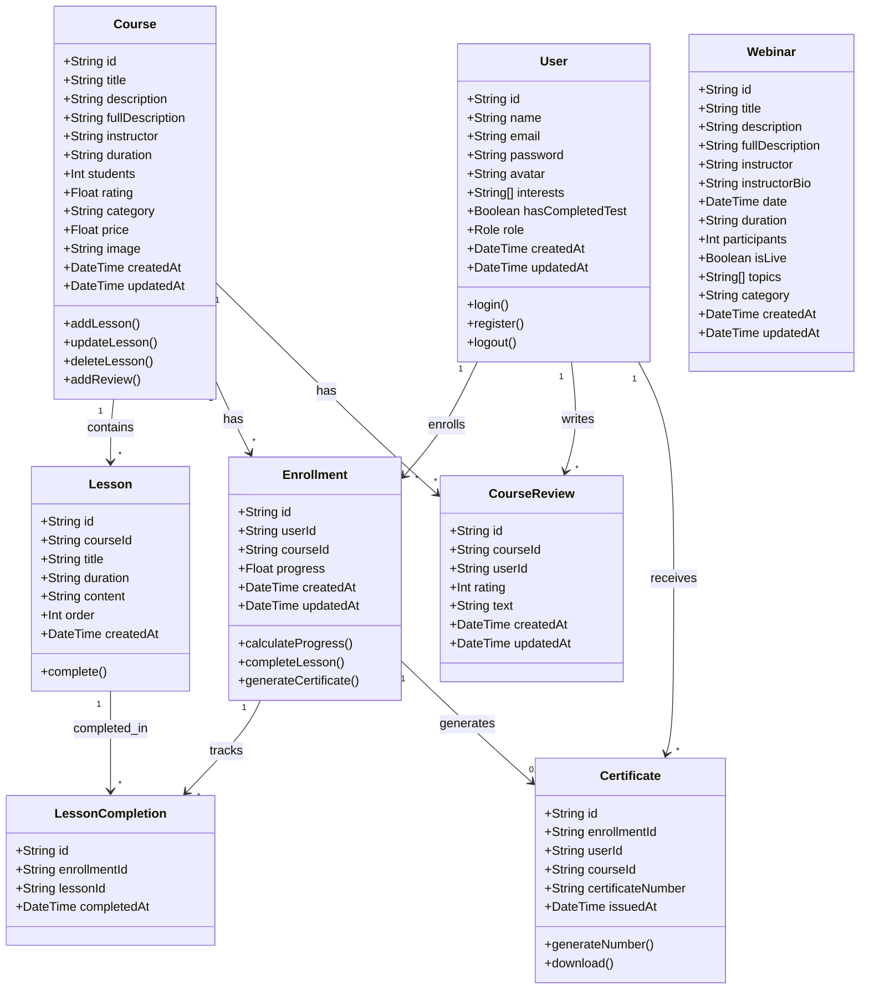
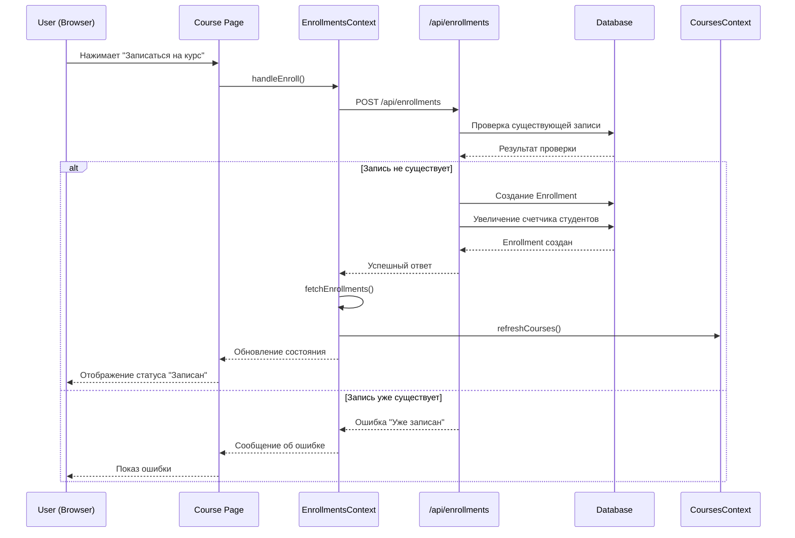
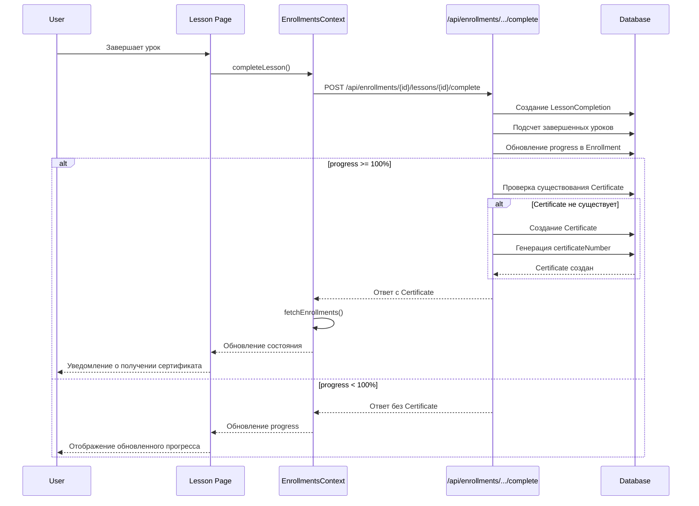
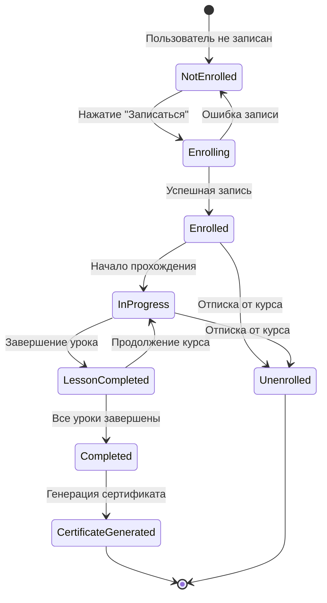
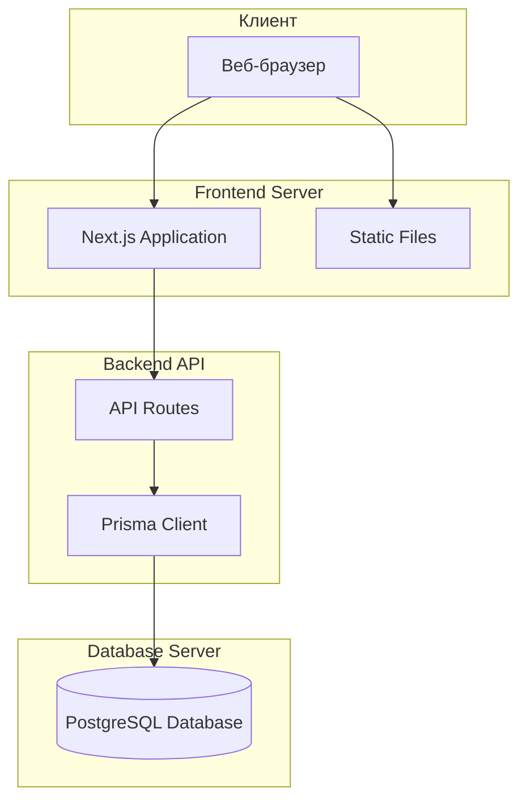

# UML Диаграммы для EduPlatform

## 1. ER-диаграмма (Entity-Relationship Diagram)

```mermaid
erDiagram
    User ||--o{ Enrollment : "имеет"
    User ||--o{ CourseReview : "пишет"
    User ||--o{ FavoriteCourse : "добавляет"
    User ||--o{ FavoriteWebinar : "добавляет"
    User ||--o{ Certificate : "получает"
    
    Course ||--o{ Lesson : "содержит"
    Course ||--o{ Enrollment : "имеет"
    Course ||--o{ CourseReview : "имеет"
    Course ||--o{ FavoriteCourse : "в избранном"
    
    Enrollment ||--o{ LessonCompletion : "отслеживает"
    Enrollment ||--|| Certificate : "генерирует"
    
    Lesson ||--o{ LessonCompletion : "завершается"
    
    Webinar ||--o{ FavoriteWebinar : "в избранном"
    
    User {
        string id PK
        string name
        string email UK
        string password
        string avatar
        string[] interests
        boolean hasCompletedTest
        enum role
        datetime createdAt
        datetime updatedAt
    }
    
    Course {
        string id PK
        string title
        string description
        string fullDescription
        string instructor
        string duration
        int students
        float rating
        string category
        float price
        string image
        datetime createdAt
        datetime updatedAt
    }
    
    Lesson {
        string id PK
        string courseId FK
        string title
        string duration
        string content
        int order
        datetime createdAt
    }
    
    Enrollment {
        string id PK
        string userId FK
        string courseId FK
        float progress
        datetime createdAt
        datetime updatedAt
    }
    
    LessonCompletion {
        string id PK
        string enrollmentId FK
        string lessonId FK
        datetime completedAt
    }
    
    Certificate {
        string id PK
        string enrollmentId FK UK
        string userId FK
        string courseId FK
        string certificateNumber UK
        datetime issuedAt
    }
    
    CourseReview {
        string id PK
        string courseId FK
        string userId FK
        int rating
        string text
        datetime createdAt
        datetime updatedAt
    }
    
    Webinar {
        string id PK
        string title
        string description
        string fullDescription
        string instructor
        string instructorBio
        datetime date
        string duration
        int participants
        boolean isLive
        string[] topics
        string category
        datetime createdAt
        datetime updatedAt
    }
    
    FavoriteCourse {
        string id PK
        string userId FK
        string courseId FK
        datetime createdAt
    }
    
    FavoriteWebinar {
        string id PK
        string userId FK
        string webinarId FK
        datetime createdAt
    }
```

## 2. Диаграмма классов (Class Diagram)



## 3. Диаграмма компонентов (Component Diagram)

```mermaid
graph TB
    subgraph "Frontend (Next.js)"
        A[Pages]
        B[Components]
        C[Contexts]
        D[API Routes]
    end
    
    subgraph "Contexts"
        C1[AuthContext]
        C2[CoursesContext]
        C3[EnrollmentsContext]
        C4[FavoritesContext]
        C5[WebinarsContext]
    end
    
    subgraph "API Layer"
        D1[/api/auth]
        D2[/api/courses]
        D3[/api/enrollments]
        D4[/api/certificates]
        D5[/api/webinars]
        D6[/api/favorites]
        D7[/api/admin]
    end
    
    subgraph "Business Logic"
        E1[Authentication Service]
        E2[Course Service]
        E3[Enrollment Service]
        E4[Certificate Service]
    end
    
    subgraph "Data Layer"
        F[Prisma ORM]
        G[(PostgreSQL Database)]
    end
    
    A --> B
    A --> C
    C --> C1
    C --> C2
    C --> C3
    C --> C4
    C --> C5
    C --> D
    D --> D1
    D --> D2
    D --> D3
    D --> D4
    D --> D5
    D --> D6
    D --> D7
    D1 --> E1
    D2 --> E2
    D3 --> E3
    D4 --> E4
    E1 --> F
    E2 --> F
    E3 --> F
    E4 --> F
    F --> G
```

## 4. Диаграмма последовательности - Запись на курс



## 5. Диаграмма последовательности - Завершение урока и получение сертификата



## 6. Диаграмма состояний - Enrollment (Запись на курс)



## 7. Диаграмма вариантов использования (Use Case Diagram)

```mermaid
graph TB
    subgraph "Актеры"
        Student[Студент]
        Teacher[Преподаватель]
        Admin[Администратор]
    end
    
    subgraph "Основные функции"
        UC1[Регистрация/Вход]
        UC2[Просмотр курсов]
        UC3[Запись на курс]
        UC4[Прохождение уроков]
        UC5[Получение сертификата]
        UC6[Просмотр вебинаров]
        UC7[Добавление в избранное]
        UC8[Оставление отзывов]
        UC9[Создание курса]
        UC10[Управление уроками]
        UC11[Управление пользователями]
        UC12[Просмотр статистики]
    end
    
    Student --> UC1
    Student --> UC2
    Student --> UC3
    Student --> UC4
    Student --> UC5
    Student --> UC6
    Student --> UC7
    Student --> UC8
    
    Teacher --> UC1
    Teacher --> UC2
    Teacher --> UC9
    Teacher --> UC10
    Teacher --> UC8
    
    Admin --> UC1
    Admin --> UC2
    Admin --> UC9
    Admin --> UC10
    Admin --> UC11
    Admin --> UC12
```



## 8. Диаграмма развертывания (Deployment Diagram)



## Описание диаграмм

### 1. ER-диаграмма
Показывает структуру базы данных, связи между таблицами и основные атрибуты каждой сущности.

### 2. Диаграмма классов
Отображает основные классы системы, их атрибуты и методы, а также отношения между классами.

### 3. Диаграмма компонентов
Демонстрирует архитектуру приложения, разделение на слои (Frontend, API, Business Logic, Data Layer).

### 4. Диаграмма последовательности - Запись на курс
Показывает пошаговый процесс записи пользователя на курс с взаимодействием между компонентами.

### 5. Диаграмма последовательности - Завершение урока
Иллюстрирует процесс завершения урока, обновления прогресса и автоматической генерации сертификата при достижении 100%.

### 6. Диаграмма состояний
Отображает жизненный цикл записи на курс (Enrollment) от момента записи до получения сертификата.

### 7. Диаграмма вариантов использования
Показывает основные функции системы и роли пользователей, которые могут их выполнять.

### 8. Диаграмма развертывания
Демонстрирует физическую архитектуру системы и взаимодействие между компонентами на уровне инфраструктуры.
